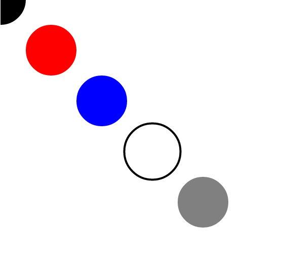

#jquery's append not working with svg element?

I am using below code to add a SVG circle to an existing svg.

```
 $(document).ready(function(){
  $("svg").append('<circle cx="100" cy="50" r="40" stroke="black" stroke-width="2" fill="red"/>');
 });
```
`Unfortunately, it doesn't work!!!`

The reason is that innerHTML is not available on SVGElement.

It is impossible to add any content into an SVGElement even it is currently an innerSVG property.


##Solution:
Using document.createElementNS(namespaceURI, qualifiedName)

+ namespaceURI is a string that `specifies the namespace URI` (A namespace URI is a URI that identifies an XML namespace.) `to associate with the element`. The namespaceURI property of the created element is `initialized with the value of namespaceURI`.

+ qualifiedName is a string that `specifies the type of element to be created`. The nodeName property of the created element is initialized with the value of qualifiedName

Creating a DOM object

+ $() accepts a DOM object. It is necessary to create a function for using document.createElementNS to create and return the element.


## example:

###html file

```
< svg version="1.1" id="circle" width="400px" height="400px">
< circle fill="#FFFFFF" stroke="#000000" stroke-width="4" stroke-miterlimit="10" cx="300" cy="300" r="55.5"/>
</ svg>

```

###js file

```
(function() {
    $(document).ready(function() {
        drawCircle();
        drawCircle(100,100,"red");
        drawCircle(200,200,"blue");
        drawCircle(400,400,"gray");
    });
})();

function SVG(tag) {
    return document.createElementNS('http://www.w3.org/2000/svg', tag);
}

var drawCircle = function(x,y,color) {
        var $svg = $("svg");
        $(SVG('circle'))
            .attr('cx', x)
            .attr('cy', y)
            .attr('r', 50)
            .attr('fill', color)
            .appendTo($svg);
};
```
